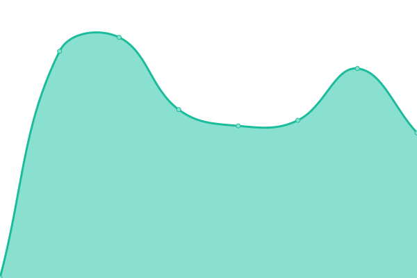
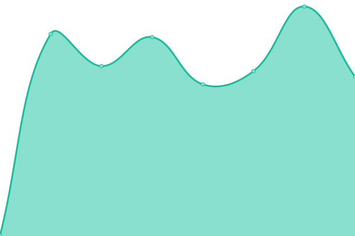

# [📈 Live-Status](https://EKG-Gniebel-Ruebgarten.github.io/website-uptime): <!--live status--> **Alle Systeme funktionieren**

This repository contains the open-source uptime monitor and status page for [EKG Gniebel Rübgarten](https://EKG-Gniebel-Ruebgarten.github.io/website-uptime), powered by [Upptime](https://github.com/upptime/upptime).

With [Upptime](https://upptime.js.org), you can get your own unlimited and free uptime monitor and status page, powered entirely by a GitHub repository. We use [Issues](https://github.com/EKG-Gniebel-Ruebgarten/website-uptime/issues) as incident reports, [Actions](https://github.com/EKG-Gniebel-Ruebgarten/website-uptime/actions) as uptime monitors, and [Pages](https://EKG-Gniebel-Ruebgarten.github.io/website-uptime) for the status page.

## [📈 Live Status](https://demo.upptime.js.org): <!--live status--> **Alle Systeme funktionieren**

<!--start: status pages-->
<!-- This summary is generated by Upptime (https://github.com/upptime/upptime) -->
<!-- Do not edit this manually, your changes will be overwritten -->
<!-- prettier-ignore -->
| URL | Status | History | Response Time | Uptime |
| --- | ------ | ------- | ------------- | ------ |
|  [EKG Gniebel Rübgarten](https://neu.ekg-gniebel-ruebgarten.de) | Funktioniert | [ekg-gniebel-ruebgarten.yml](https://github.com/EKG-Gniebel-Ruebgarten/website-uptime/commits/HEAD/history/ekg-gniebel-ruebgarten.yml) | 

 1765ms
     
 | 

<a href="https://EKG-Gniebel-Ruebgarten.github.io/website-uptime/history/ekg-gniebel-ruebgarten">100.00%</a>
    

|  Backend | Funktioniert | [backend.yml](https://github.com/EKG-Gniebel-Ruebgarten/website-uptime/commits/HEAD/history/backend.yml) | 

 497ms
     
 | 

<a href="https://EKG-Gniebel-Ruebgarten.github.io/website-uptime/history/backend">100.00%</a>
    

|  [Medien-Doku](https://medien.doku.ekg-gniebel-ruebgarten.de) | Funktioniert | [medien-doku.yml](https://github.com/EKG-Gniebel-Ruebgarten/website-uptime/commits/HEAD/history/medien-doku.yml) | 

 170ms
     
 | 

<a href="https://EKG-Gniebel-Ruebgarten.github.io/website-uptime/history/medien-doku">100.00%</a>
    

|  [Backend-Doku](https://backend.doku.ekg-gniebel-ruebgarten.de) | Funktioniert | [backend-doku.yml](https://github.com/EKG-Gniebel-Ruebgarten/website-uptime/commits/HEAD/history/backend-doku.yml) | 

 142ms
     
 | 

<a href="https://EKG-Gniebel-Ruebgarten.github.io/website-uptime/history/backend-doku">100.00%</a>
    

<!--end: status pages-->

[**Visit our status website →**](https://EKG-Gniebel-Ruebgarten.github.io/website-uptime)

## 📄 License

- Powered by: [Upptime](https://github.com/upptime/upptime)
- Code: [MIT](./LICENSE) © [EKG Gniebel Rübgarten](https://EKG-Gniebel-Ruebgarten.github.io/website-uptime)
- Data in the `./history` directory: [Open Database License](https://opendatacommons.org/licenses/odbl/1-0/)
